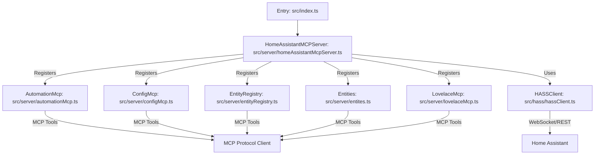

# Architecture

- **Main entry:** [`src/index.ts`](src/index.ts:1) — Instantiates and starts the MCP server.
- **MCP server:** [`src/server/homeAssistantMcpServer.ts`](src/server/homeAssistantMcpServer.ts:1) — Orchestrates all MCP modules, manages Home Assistant connection, and registers all tools.
- **MCP modules (tools):**
  - [`src/server/automationMcp.ts`](src/server/automationMcp.ts:1) — Automation CRUD, trace, device triggers.
  - [`src/server/configMcp.ts`](src/server/configMcp.ts:1) — Home Assistant configuration tools.
  - [`src/server/entityRegistry.ts`](src/server/entityRegistry.ts:1) — Entity registry management.
  - [`src/server/entites.ts`](src/server/entites.ts:1) — Entity CRUD and queries.
  - [`src/server/lovelaceMcp.ts`](src/server/lovelaceMcp.ts:1) — Lovelace dashboard and resource management.
  - [`src/server/baseMcp.ts`](src/server/baseMcp.ts:1) — Base class for MCP modules.
- **Home Assistant integration:**
  - [`src/hass/hassClient.ts`](src/hass/hassClient.ts:1) — Main API client, wraps `home-assistant-js-websocket` and REST endpoints.
  - [`src/hass/types.ts`](src/hass/types.ts:1) — Shared Home Assistant types.
  - [`src/hass/hassCollectionSubscriber.ts`](src/hass/hassCollectionSubscriber.ts:1) — (Optional) Entity registry subscription.
- **Testing:**
  - [`tests/homeAssistantMcpServer.test.ts`](tests/homeAssistantMcpServer.test.ts:1), [`tests/hassClient.test.ts`](tests/hassClient.test.ts:1) — Unit/integration tests.
  - Dual-mode: mock or real Home Assistant instance, auto-detected via [`tests/hass-real-config.ts`](tests/hass-real-config.ts:1).
- **Transport Layer:**
  - [`src/mcpTransports.ts`](src/mcpTransports.ts:1) — Multiple MCP transport options (stdio, SSE, streamablehttp).
- **Configuration & Tooling:**
  - [`Dockerfile`](Dockerfile:1), Docker Compose — Containerization.
  - [`package.json`](package.json:1), [`tsconfig.json`](tsconfig.json:1) — Build and dependency management.
  - [`vitest.config.ts`](vitest.config.ts:1) — Test runner config.
  - [`scripts/tools-to-markdown.js`](scripts/tools-to-markdown.js:1) — MCP tool documentation generator.
  - [`tools.md`](tools.md:1) — Generated documentation of all many MCP tools.
  - ESLint for formatting and linting (replaces Prettier).

## Architectural Patterns & Decisions

- **Modular MCP tool registration:** Each domain (automation, config, registry, entities, Lovelace) is encapsulated in its own class and registered with the main server.
- **Single Home Assistant client:** [`HASSClient`](src/hass/hassClient.ts:1) is shared across all modules for efficient API usage.
- **Extensibility:** New MCP modules can be added by subclassing [`baseMcp.ts`](src/server/baseMcp.ts:1) and registering in the server.
- **Multiple transport options:** Supports stdio (default), SSE, and streamablehttp transports for different deployment scenarios.
- **Comprehensive type system:** Uses Zod schemas throughout for runtime validation and JSON schema generation.
- **Environment-driven config:** All critical parameters (URL, token, debug, transport, port, etc.) are set via environment variables.
- **Automated documentation:** MCP Inspector integration generates tool documentation automatically.
- **Testing:** Supports both isolated (mock) and real Home Assistant integration for robust CI and local development.

## System Diagram

